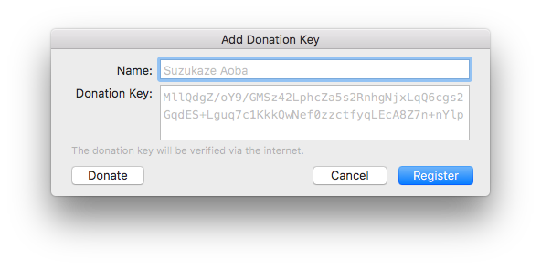

While MAL Library is free and open source software, hosting the Atarashii-API and maintaining the Apple Developer Program costs money. This is why the donation reminder dialog will show up at launch. This only applies if you didn't download MAL Library from the Mac App Store.

These features require a donation key or an App Store version:
* Managing Manga lists and viewing information of Manga titles
* List Statistics
* Importing of lists from Kitsu, AniList and AniDB (XML)
* Importing and Exporting of Manga lists.
* Viewing source material information in Anime Information view
* Viewing cast information of an anime title.
* Viewing profiles and lists from different users.

The donation key requires online activation to work and MAL Library will check the validity of the key when it's on the internet at launch. The donation key is encrypted and when it's checked, it will be decrypted and checked against a database.

You can obtain a donation key by [donating](https://softwareateliershiori.onfastspring.com/mal-library-mal-updater-os-x-donation-license) a minimum of 5 dollars. You may use the key on many Macs you want, but you may not share it. If you are caught sharing it, the key will be revoked. The key will be sent to you within 24 hours after the transaction is cleared. The donation keys for MAL Updater OS X is valid for MAL Library.

If you lost your key, you can retrieve it [here](http://malupdaterosx.ateliershiori.moe/lostkey.php).

You can also purchase MAL Library from the App Store. You can use this to remove donation reminders in MAL Updater OS X.

## Registering MAL Updater OS X with an App Store copy of MAL library

It's possible to register MAL Updater OS X if you purchased MAL Library from the App Store. Click on the MAL Updater OS X icon > Enter Donation Key. You will see a button "Register with MAL Library App Store Version." Click that and MAL Updater OS X should register instantly.

## Notice
If you are developing a fork, please set up your own Atarashii-API server. The default API server is only for official copies of MAL Library, MAL Updater OS X and Hachidori. By doing so, you are pirating the software and violating the terms of service.
