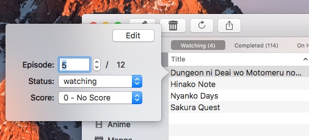

Shukofukuro makes it easy to add and update new titles to your list.

## Updating existing entries

Yiu can update existing entries by double clicking on a title on your list (if "Modify Title" is set for double click action) or clicking the pencil toolbar icon (edit). A popover will appear. This popover allows you to update an entry on your list.

Choosing to do an Advanced Edit allows you to modify more options, like setting a library entry to private, rewatching, start/end dates, tags and notes.

## Adding titles

By pressing the + button, you can add a title. You can add titles from search view, season browser and airing browser as long the title doesn't exist on your list. Like with updating existing entries, a popover will appear when you add new titles to your list.
