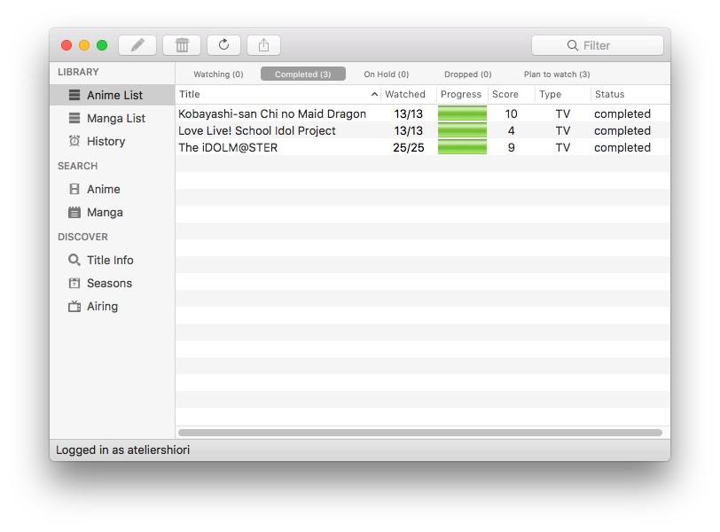
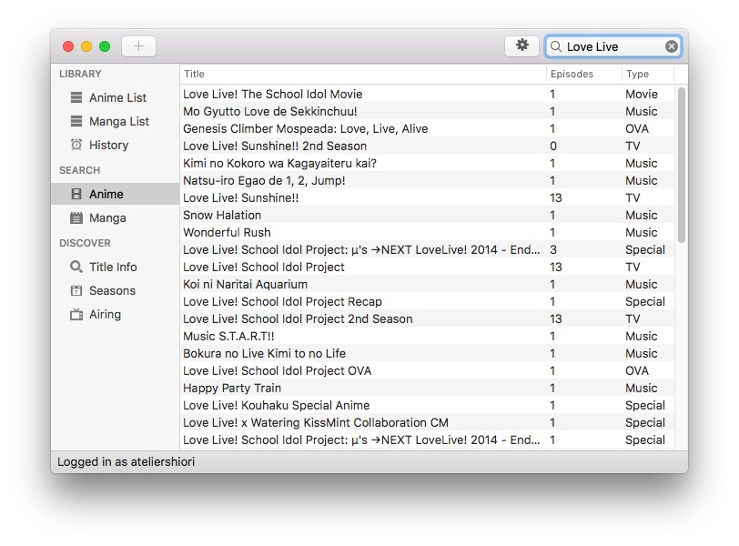
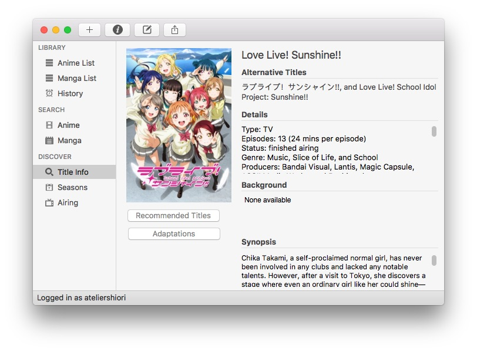

MAL Library is a native MyAnimeList and Kitsu tracker. While you don't need to login, to use the list management functions, you need to add an account. MAL Library will prompt you to login at start up.

## Main Window
Here are the functionality available:
## Library

* Anime List - Allows you to manage your anime list, requires login.
* Manga List - Allows you to manage your manga library, requires login and Donation Key or App Store version.
* History - Shows the update history from MyAnimeList.

## Search

* Anime Search - Allows you to search for anime titles to view information on or to add to your list.
* Manga Search - Allows you to search for manga titles to view information on or to add to your list. Requires a donation key or App Store version.

## Discover

* Title Info - Shows title of a selected anime or manga. It will show a placeholder if nothing loaded
* Seasons - Browse through a list of titles that aired in a given season and year.
* Airing - Browse through shows that are currently airing by day.

## Service Menu
The service menu allows you to switch between list services. If you have a title loaded in Title Information, MAL Library will atempt to load title information on the chosen service while loading lists associated to the service. Note that you have to log into the respective service in order to manage your list.

