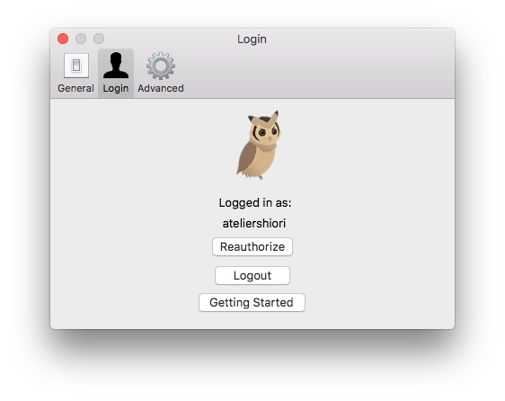
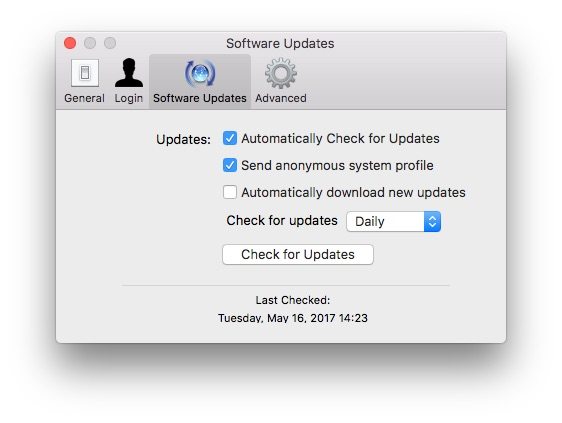
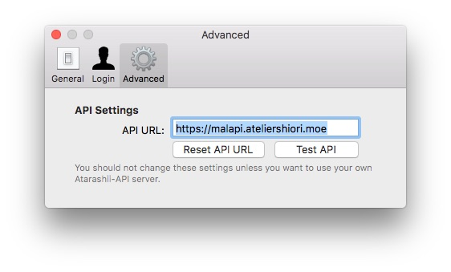

The Preferences window allows you to change various settings

## General

### List Options
* Double Click Action - Specifies the action when an item is double clicked in the library view. The possible actions are Do Nothing, View Info and Modify Title.
* Refresh List on start - MAL Library will refresh your list when MAL Library is launched.
* Refresh List Automatically - This allows MAL Library to refresh your list periodically.
* Use Status Filters as Tabs - The filters will act like tabs and only view titles with the selected status filter.

### General
* Appearance - Sets the appearance of the main window. Possible options are light or dark.
* Clear Image Cache - Clears the poster image cache.

## Login

Allows you to login or log out of your account. Credentials are saved in the login Keychain.

## Software Updates (Non-Appstore Version)

* Automatically Check for Updates - MAL Library will check for new updates automatically
* Send anonymous system profile - Sends system information (CPU, memory, macOS version) and the version of MAL Library when you update. No personal information is sent.
* Automatically download new updates - MAL Library will download new updates automatically. When you quit MAL Library, it will install the new version.

## Advanced

* API Settings - Allows you to specify an MAL API server to use. 
