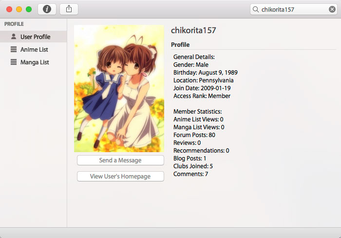

In MAL Library 2.4, you can view profiles of other users including lists. This option is only aviliable for registered users.

In the Profile Browser, you can
* View basic information on a user
* View a user's anime and manga list
* View a user's history.
* View a user's list statistics.

To access the Profile Browser, click on the MyAnimeList menu on the menu bar and select "Profile Browser." In the Profile View, enter a username on the search bar and press enter. Then it will load the user's profile and lists.
